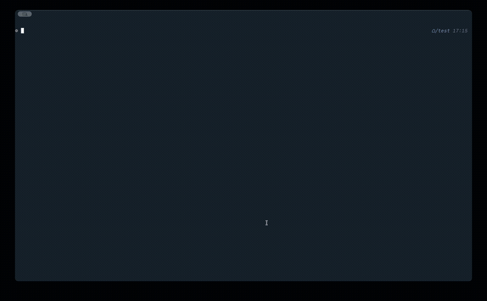

# coding-agent

A terminal-based AI coding assistant that reads, writes, and runs code through tool calls. Point it at any OpenAI-compatible API and it becomes a pair programmer that can explore your codebase, edit files, run commands, and search the web.

<p align="center">
  
</p>

## Quick start

```bash
# Clone and install
git clone https://github.com/Kiran-Jones/coding-agent.git
cd coding-agent
cp .env.example .env   # add your API key and endpoint
make install

# Run
coding-agent
```

## What it can do

The agent has eight built-in tools it calls autonomously:

- **Read & write files** with automatic undo/redo snapshots
- **Run terminal commands** with streaming output
- **Search the web** and **read webpages** via DuckDuckGo
- **Git operations** with command-chaining protection
- **Planning mode** (`/plan`) for read-only exploration before making changes

It also supports [MCP servers](https://modelcontextprotocol.io/) for extending its capabilities.

<!-- TODO: Screenshot of the agent completing a multi-step task (tool calls, file edits, terminal output) -->
<!--  -->

## Slash commands

| Command | Description |
|---------|-------------|
| `/plan` | Enter planning mode (read-only exploration) |
| `/new` | Start a new session |
| `/sessions` | List saved sessions |
| `/load` `/delete` | Manage sessions |
| `/model` | Switch model |
| `/undo` `/redo` | Revert or replay file changes |
| `/history` | View snapshot history |
| `/mcp` | Show MCP server status |
| `/verbose` | Toggle detailed tool output |
| `/usage` | Show token counts |

## File mentions

Reference files directly in your prompt with `@`:

```
@src/agent.py refactor the _parse_stream method
@utils.py:10-25 explain these lines
```

<!-- TODO: Short clip or screenshot showing @file autocomplete in action -->
<!--  -->

## Configuration

**Environment** (`.env`):

```
API_KEY=your-api-key
ENDPOINT_URL=http://localhost:8000/v1/chat/completions
MODEL_NAME=your-model
```

**Agent context**: Drop an `AGENT.md` file in your project root (or `~/.coding-agent/AGENT.md` globally) to give the agent persistent instructions.

**MCP servers**: Add a `mcp_config.json` to your project or `~/.coding-agent/mcp_config.json` globally. See `mcp_config.example.json` for the format.

## Development

```bash
make install       # Install deps (including dev tools)
make check         # Lint + format check + type check
make test          # Run all tests
make format        # Auto-format code
```

## Architecture

```
src/coding_agent/
  main.py              CLI, REPL, slash commands
  agent.py             Core agent loop and tool dispatch
  tools.py             Built-in tools with auto-generated schemas
  mcp_manager.py       MCP server lifecycle and tool routing
  session_manager.py   Conversation persistence
  snapshot_manager.py  File change tracking (undo/redo)
  memory_utils.py      Context window compaction
  agent_ui.py          Streaming display and approval prompts
  markdown_renderer.py Syntax-highlighted markdown output
  status_bar.py        Terminal status line
```

## License

<!-- TODO: Add license -->
